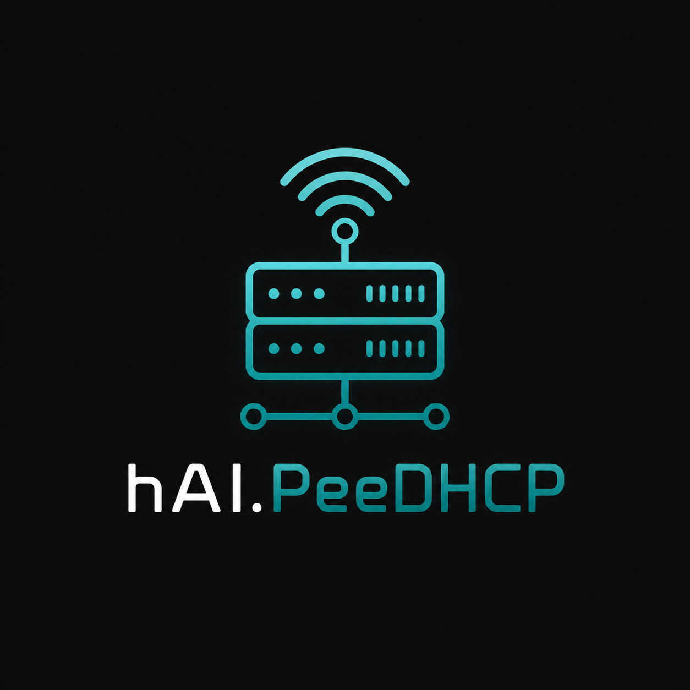

# hAI.PeeDHCP



> **DHCP-Admin-Oberfläche für PiHole v6** – Docker-basiert, keine externe Datenbank, direkte REST-API-Anbindung.

---

## Features

- 📋 **Alle Geräte** – kombinierte Liste aus aktiven Leases + statischen Einträgen
- 🔖 **Statisch fixieren** – dynamischen Lease als statische MAC→IP-Bindung speichern
- 🔄 **Lease verlängern** – aktiven Lease löschen, Gerät holt sich neuen
- 🗑️ **Löschen** – statischen Eintrag entfernen oder aktiven Lease kappen
- 📊 **Übersicht** – Kacheln mit Lease-Anzahl, Pool-Größe, Leasetime
- ⚙️ **Konfiguration** – DHCP-Start/End, Router, DNS, Leasetime bearbeiten
- 📝 **DHCP-Log** – gefilterte Ansicht (ACK / OFFER / REQUEST)
- 🌙 **Dark/Light Mode** – per Klick umschaltbar
- 🔍 **Suche & Filter** – nach Hostname, IP, MAC, Typ
- ↕️ **Sortierung** – alle Tabellenspalten sortierbar

---

## PiHole v6 API-Mapping

| Funktion | PiHole v6 Endpunkt |
|---|---|
| Aktive Leases | `GET /api/dhcp/leases` |
| Statische Einträge lesen | `GET /api/config/dhcp` → `hosts[]` |
| Statischen Eintrag hinzufügen | `PATCH /api/config/dhcp` |
| Statischen Eintrag löschen | `PATCH /api/config/dhcp` |
| Lease löschen / erneuern | `DELETE /api/dhcp/leases/{mac}` |
| DHCP-Konfiguration | `GET/PATCH /api/config/dhcp` |
| DNS-Konfiguration | `GET /api/config/dns` |
| Log/Queries | `GET /api/queries` |
| Health-Check | `GET /api/stats/summary` |

> **Hinweis:** `/api/dhcp/static_leases` existiert in PiHole v6 **nicht**. Statische Einträge werden als `hosts`-Array in `/api/config/dhcp` gespeichert (Format: `MAC,IP,Hostname`).

---

## Schnellstart

### Voraussetzungen
- Docker + Docker Compose
- PiHole v6 mit aktivierter REST-API

### Installation

```bash
git clone https://github.com/jbkunama1/hAI.PeeDHCP.git
cd hAI.PeeDHCP
cp .env.example .env
# .env anpassen (PIHOLE_URL, PIHOLE_PASSWORD)
docker compose up -d --build
```

Danach erreichbar unter: **http://localhost:8080**

### .env Konfiguration

```env
PIHOLE_URL=http://192.168.178.1
PIHOLE_PASSWORD=dein_passwort
LOG_LEVEL=INFO
```

---

## Update

```bash
git pull
docker compose up -d --build
```

---

## Projektstruktur

```
hAI.PeeDHCP/
├── backend/
│   └── app.py          # Flask REST-API, PiHole v6 Proxy
├── frontend/
│   └── index.html      # Single-Page-App (Vanilla JS)
├── Dockerfile
├── docker-compose.yml
├── .env.example
└── README.md
```

---

## API-Endpunkte (Backend)

| Methode | Pfad | Beschreibung |
|---|---|---|
| GET | `/api/health` | PiHole-Verbindungstest |
| GET | `/api/leases` | Aktive DHCP-Leases |
| GET | `/api/all_devices` | Alle Geräte (Leases + Statisch kombiniert) |
| GET | `/api/static` | Statische Einträge |
| POST | `/api/static` | Statischen Eintrag hinzufügen/aktualisieren |
| DELETE | `/api/static/<mac>` | Statischen Eintrag löschen |
| POST | `/api/lease/renew` | Lease zurücksetzen (Erneuerung erzwingen) |
| DELETE | `/api/lease/<mac>` | Aktiven Lease löschen |
| GET | `/api/config` | DHCP/DNS-Konfiguration lesen |
| POST | `/api/config` | DHCP-Konfiguration speichern |
| GET | `/api/log` | DHCP-Log-Einträge |

---

## Lizenz

MIT – siehe [LICENSE](LICENSE)
