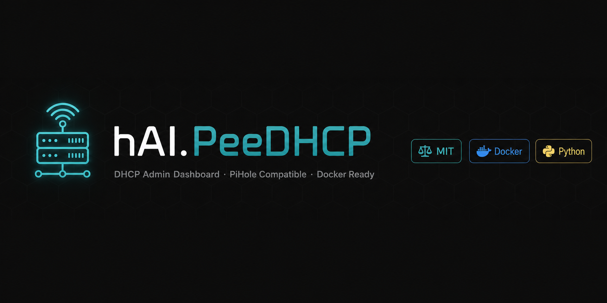

<div align="center">



# 🌐 hAI.PeeDHCP

**DHCP Admin Dashboard für PiHole – als Portainer Stack**

[](LICENSE)
[](docker-compose.yml)
[](backend/app.py)
[](https://pi-hole.net)
[](.github/workflows/trufflehog.yml)
[](https://github.com/jbkunama1/hAI.PeeDHCP/commits)

> Eine schlanke, containerisierte Admin-Oberfläche zum Lesen und Verwalten der PiHole-DHCP-Konfiguration –  
> **PiHole bleibt dabei vollständig primär und funktionsfähig.**

</div>

---

## ✨ Features

| Feature | Beschreibung |
|---|---|
| 📊 **Dashboard** | KPI-Cards: aktive Leases, statische Einträge, Pool-Größe, Leasetime |
| 📋 **Aktive Leases** | Echtzeit-Tabelle aus `dnsmasq.leases` mit Suchfilter |
| 📌 **Statische Einträge** | MAC → IP Bindungen hinzufügen, löschen, bearbeiten |
| ⚙️ **Konfiguration** | DHCP-Pool, Gateway, DNS, Leasetime über Web-UI bearbeiten |
| 📄 **DHCP-Log** | Live-Logansicht mit Farbfilter (ACK / OFFER / REQUEST) |
| 🔄 **Auto-Reload** | Nach jeder Änderung wird `pihole restartdns reload` ausgelöst |
| 🌙 **Dark/Light Mode** | System-aware Theme, manuell umschaltbar |
| 🐳 **Portainer-Ready** | Einzelner Stack, keine externen Abhängigkeiten |

---

## 🏗️ Architektur

```
┌─────────────────────────────────────────────────────┐
│                    Host (DietPi/Debian)             │
│                                                     │
│  ┌──────────────┐        ┌───────────────────────┐  │
│  │   PiHole     │        │   hAI.PeeDHCP Stack   │  │
│  │  (primär)    │        │                       │  │
│  │              │        │  ┌─────────────────┐  │  │
│  │  dnsmasq     │◄──────►│  │ Flask Backend   │  │  │
│  │  setupVars   │ Volumes│  │ :8080           │  │  │
│  │  dhcp.leases │        │  └────────┬────────┘  │  │
│  └──────────────┘        │           │           │  │
│                          │  ┌────────▼────────┐  │  │
│                          │  │ Static Frontend │  │  │
│                          │  │ (Gunicorn :8080)│  │  │
│                          │  └─────────────────┘  │  │
│                          └───────────────────────┘  │
│                                   │                  │
│                              Port 8095               │
└─────────────────────────────────────────────────────┘
```

### Dateizugriff (Docker Volumes)

| Datei auf dem Host | Mount im Container | Zugriff | Verwendung |
|---|---|---|---|
| `/var/lib/misc/dnsmasq.leases` | `/data/leases/dnsmasq.leases` | 🔒 read-only | Aktive Leases anzeigen |
| `/etc/dnsmasq.d/04-pihole-static-dhcp.conf` | `/data/dnsmasq/04-pihole-static-dhcp.conf` | ✏️ read/write | Statische Einträge |
| `/etc/pihole/setupVars.conf` | `/data/pihole/setupVars.conf` | ✏️ read/write | DHCP-Konfiguration |
| `/etc/dnsmasq.d/02-pihole-dhcp.conf` | `/data/dnsmasq/02-pihole-dhcp.conf` | ✏️ read/write | Pool & Leasetime |
| `/var/log/pihole.log` | `/data/pihole.log` | 🔒 read-only | DHCP-Logs |

---

## 🚀 Installation

### Voraussetzungen

- Docker & Docker Compose (oder Portainer)
- PiHole läuft bereits auf demselben Host
- Port `8095` frei

### 1️⃣ Repository klonen

```bash
git clone https://github.com/jbkunama1/hAI.PeeDHCP.git
cd hAI.PeeDHCP
```

### 2️⃣ Umgebungsvariablen konfigurieren

```bash
cp .env.example .env
joe .env
```

```env
SECRET_KEY=dein-sicherer-zufallsstring
PIHOLE_LEASES=/var/lib/misc/dnsmasq.leases
PIHOLE_STATIC_CONF=/etc/dnsmasq.d/04-pihole-static-dhcp.conf
PIHOLE_SETUPVARS=/etc/pihole/setupVars.conf
PIHOLE_LOG=/var/log/pihole.log
TZ=Europe/Berlin
```

### 3️⃣ Als Portainer Stack deployen

In Portainer → **Stacks → Add Stack → Upload** → `docker-compose.yml`

Oder direkt per CLI:

```bash
docker compose up -d
```

### 4️⃣ Dashboard aufrufen

```
http://<server-ip>:8095
```

> **Tipp für Produktion:** Hinter Traefik mit BasicAuth oder Cloudflare Access schützen.

---

## 🔒 Sicherheitshinweise

> ⚠️ **WICHTIG** – Das Dashboard hat Schreibzugriff auf PiHole-Konfigurationsdateien.

- **Nie direkt ins Internet** exponieren – nur im LAN oder via VPN/Tunnel
- `SECRET_KEY` als Portainer-Environment-Secret hinterlegen
- Zugriff per Traefik + BasicAuth oder [Cloudflare Access](https://developers.cloudflare.com/cloudflare-one/applications/configure-apps/) absichern

---

## 📁 Projektstruktur

```
hAI.PeeDHCP/
├── .github/
│   └── workflows/
│       └── trufflehog.yml       # Secret Scanning
├── backend/
│   ├── app.py                   # Flask API
│   └── requirements.txt
├── frontend/
│   └── index.html               # Single-Page Admin UI
├── docs/
│   └── banner.png               # GitHub README Banner
├── .env.example
├── .gitignore
├── docker-compose.yml
├── Dockerfile
├── LICENSE
└── README.md
```

---

## 🔧 API-Endpunkte

| Method | Endpoint | Beschreibung |
|---|---|---|
| `GET` | `/api/leases` | Alle aktiven DHCP-Leases |
| `GET` | `/api/static` | Statische MAC→IP Einträge |
| `POST` | `/api/static` | Neuen statischen Eintrag hinzufügen |
| `DELETE` | `/api/static/<mac>` | Eintrag löschen |
| `GET` | `/api/config` | DHCP-Konfiguration lesen |
| `POST` | `/api/config` | Konfiguration speichern + reload |
| `GET` | `/api/log` | DHCP-Log (letzte 200 Zeilen) |
| `GET` | `/api/health` | Health Check |

---

## 🛡️ Security Scanning

Dieses Repository verwendet **TruffleHog** für automatisiertes Secret-Scanning bei jedem Push und Pull Request. Erkannte Secrets blockieren den Merge.

---

## 📄 Lizenz

Dieses Projekt steht unter der [MIT License](LICENSE).

---

<div align="center">

Made with ❤️ by [@jbkunama1](https://github.com/jbkunama1) &nbsp;|&nbsp; Part of the **hAI.** project family

[](https://github.com/jbkunama1/hAI.FIN)
[](https://github.com/jbkunama1/hAI.WMPlan)
[](https://github.com/jbkunama1/hAI.PeeDHCP)

</div>
